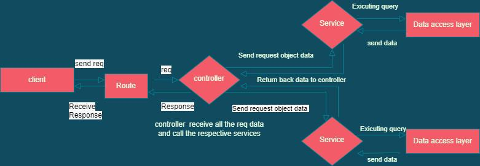

### Giới thiệu
Học viết **REST Api** bằng Node

### Điều kiện tiên quyết
Để tiếp tục, tối thiểu phải có môi trường để chạy Node

### Cài đặt
> npm install

> npm run dev

### Chức năng
- Authentication: 
    - login
    - register
    - verify token
    - refresh token
    - phân quyền: user, moderator, admin

- User:
    - get current user

- Book:
    - create a book
    - get books
    - update book by id
    - delete book by id

- Upload images to cloundinary

**→ API docs in /assets/study-rest-api-by-node.postman_collection.json**

### Work Flow
1. Route > nhận request từ browser
2. Controller > nơi tiếp nhận các request
4. Service > tất cả cá business login này ở đây
3. Model > tương tác với database

### Cấu trúc thư mục
- **src/config**: chứa các file config sequelize
- **src/data**: chứa các mockup data
- **src/middlewares**: chứa middleware verify token hoặc phân quyền
- **src/migrations**: folder migration của **sequelize**
- **src/models**: chứa các file định nghĩa các model khi sử dụng sequelize
- **src/routes**: chứa các route của hệ thống
- **src/controllers**: chứa các controller tương ứng các route
- **src/services**: chứa các service của hệ thống
- **src/utils**: chứa các pure function

### Một số ghi chú khác
##### Error Handling
Có hai loại error trong Node js

**1. Operational errors**
- Xảy ra trong quá trình ứng dụng hoạt động, nguyên nhân thường là do các đầu vào không bình thường 
- Không cần khởi động lại ứng dụng

**1. Programmer errors**
- Nguyên nhân thường đến từ chất lượng của code không tốt
- cần khởi động lại ứng dụng

